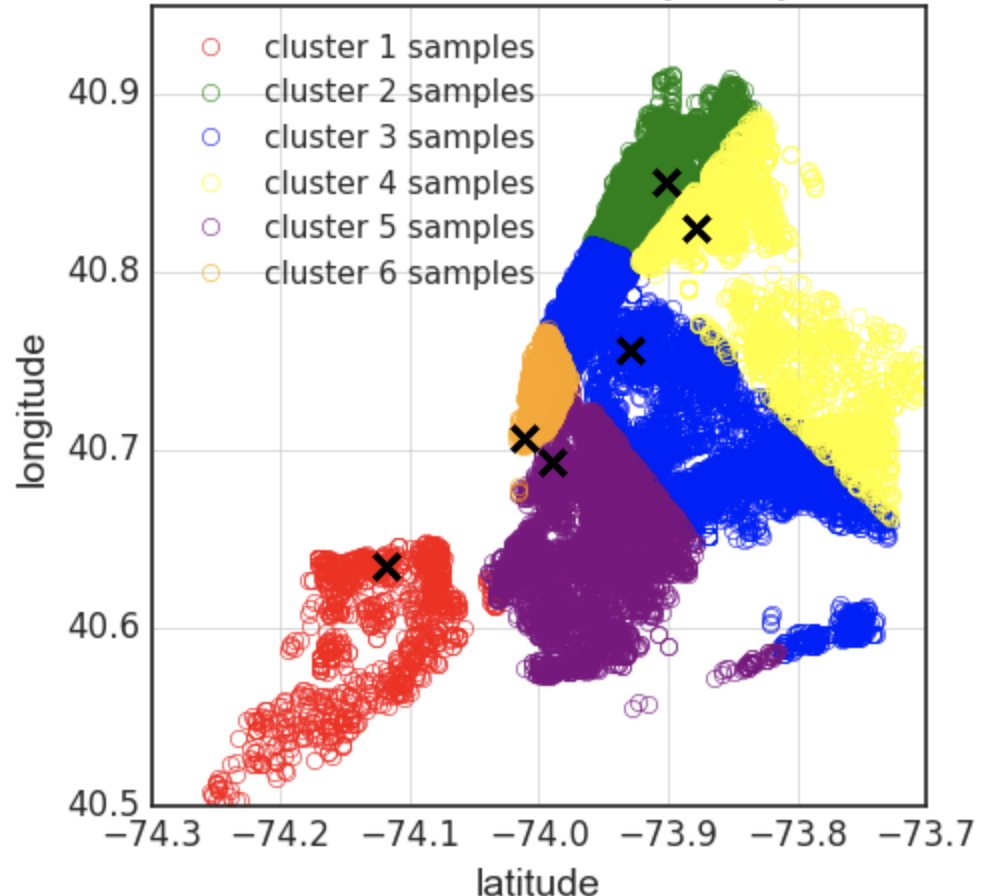

# Re-drawing NYC's borough boundaries using clustered crime statistics (in progress...)

What would NYC's borough boundaries look like if they were redrawn to reflect variations in reported crime statistics?
